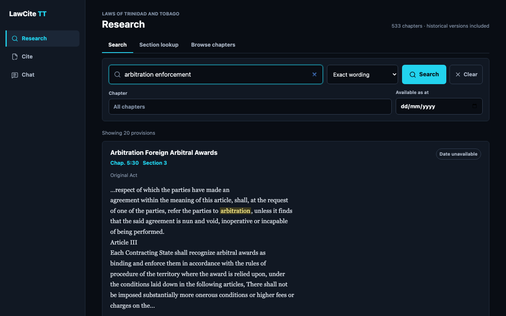
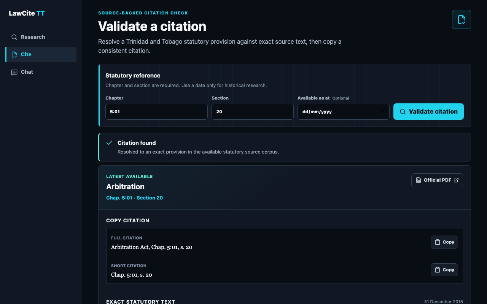
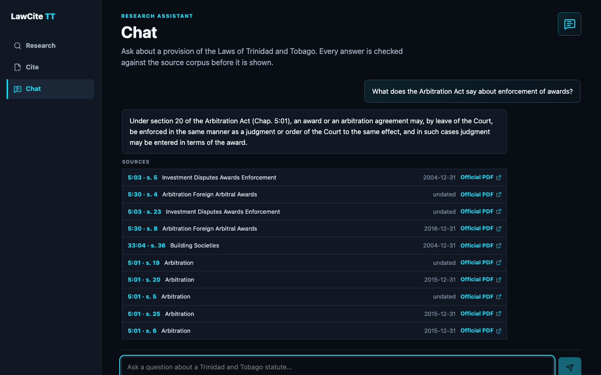
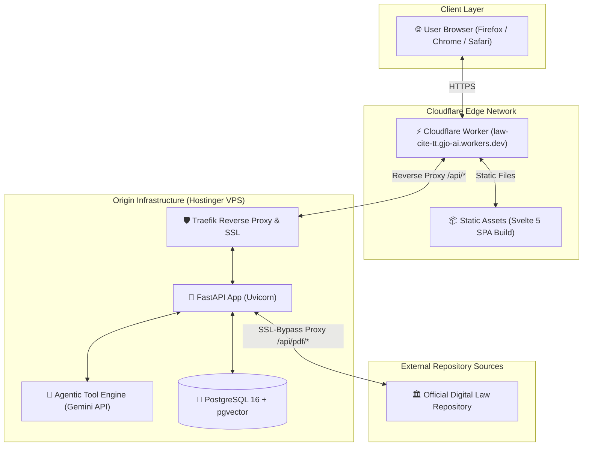

<div align="center">

# ⚖️ LawCite TT

### *Temporal Legal Engine & Citation Graph for the Laws of Trinidad and Tobago*

[](https://law-cite-tt.gjo-ai.workers.dev)
[-10b981?style=for-the-badge&logo=fastapi)](https://law-cite-tt.gjo-ai.workers.dev/api/health)
[](https://law-cite-tt.gjo-ai.workers.dev)
[](LICENSE)

---

[**Explore Live App**](https://law-cite-tt.gjo-ai.workers.dev) • [**API Health**](https://law-cite-tt.gjo-ai.workers.dev/api/health) • [**Features**](#-key-features) • [**Architecture**](#-architecture) • [**Local Setup**](#-getting-started)

</div>

<br/>

## 🌟 Overview

**LawCite TT** is an advanced legal research engine and temporal citation platform indexing the complete statutory laws and judicial precedent of **Trinidad and Tobago**. 

By digitizing and section-chunking all **533 statutory chapters** across **4,989 historical revisions** (spanning back to the 1800s), LawCite TT enables point-in-time statutory research (*"What did Section 5 of the Arbitration Act state as of December 31, 2016?"*), hybrid full-text + vector semantic search, and citation graph exploration across **7,914 case-law precedent edges**.

---

## 📸 Screenshots

<table>
  <tr>
    <td align="center"><strong>Research</strong></td>
    <td align="center"><strong>Cite</strong></td>
    <td align="center"><strong>Chat</strong></td>
  </tr>
  <tr>
    <td></td>
    <td></td>
    <td></td>
  </tr>
</table>

---

## ⚡ Key Features

<table>
  <tr>
    <td width="50%">
      <h3>🔍 Point-in-Time Legal Search</h3>
      <p>Search statutory provisions as they existed on any historical date. Combines natural language semantic search with precise keyword matching for instant, accurate legislative research.</p>
    </td>
    <td width="50%">
      <h3>🤖 Intelligent Legal AI Assistant</h3>
      <p>An interactive legal assistant that analyzes statutory provisions, identifies relevant judicial precedents, and synthesizes structured legal answers in real time.</p>
    </td>
  </tr>
  <tr>
    <td width="50%">
      <h3>📜 Citation Verification & Resolution</h3>
      <p>Instantly resolve and verify legal citations across all statutory chapters. Generates authoritative excerpts, edition histories, and copy-ready legal references.</p>
    </td>
    <td width="50%">
      <h3>🕸️ Judicial Precedent Graph</h3>
      <p>Explore relationships between statutory acts and High Court or Court of Appeal judgments, illuminating how courts have interpreted specific legislative provisions.</p>
    </td>
  </tr>
  <tr>
    <td width="50%">
      <h3>📄 Seamless Official Document Viewer</h3>
      <p>View and inspect official statutory PDF revisions inline with high-reliability document streaming and instant browser preview capabilities.</p>
    </td>
    <td width="50%">
      <h3>⚡ Global Edge Performance & Security</h3>
      <p>Built on an enterprise-grade edge architecture with distributed caching, end-to-end HTTPS encryption, and sub-second query response times worldwide.</p>
    </td>
  </tr>
</table>


---

## 📊 Corpus Statistics

| Metric | Count | Description |
| :--- | :---: | :--- |
| **Statutory Chapters** | `533` | Complete Laws of Trinidad and Tobago (Chap. 1:01 to 90:03) |
| **Historical Revisions** | `4,989` | Point-in-time revised editions from the 1800s to 2024 |
| **Embedded Chunks** | `407,008` | Section-aware statutory text chunks (384-dimensional vector index) |
| **Case Law Judgments** | `2,236` | Modern Supreme Court / High Court decisions |
| **Citation Edges** | `7,914` | Explicit statute-to-case citation links |

---

## 🏗️ Architecture



## 🤖 AI Engineering & System Architecture

This project serves as a production-grade demonstration of modern **AI Engineering, RAG Systems, Agentic Workflows, and High-Performance Legal Search Architecture**.

### 1. Autonomous Tool-Calling Agent Loop
* **Multi-Tool Orchestration**: Powered by a custom agent runtime (`backend/api/agent.py`) using OpenAI-compatible tool specifications (`search_provisions`, `lookup_section`, `citing_cases`, `search_cases`, `expand_case`).
* **Grounding & Provenance Guardrails**: Enforces strict anti-hallucination system prompts. Answers are required to cite specific statutory provisions or case nodes, returning structured source references (`sources`) for every statement.
* **Precedent Graph Navigation**: The agent can autonomously traverse from a statutory chapter to its citing judicial decisions and expand multi-hop precedent chains.

### 2. Hybrid RAG & Vector Search
* **Dual Retrieval Pipeline**: Combines lexical Full-Text Search (PostgreSQL `tsvector` / `tsquery`) with dense 384-dimensional vector embeddings (`FastEmbed` `BAAI/bge-small-en-v1.5`).
* **Scale & Indexing**: Indexes **407,008 statutory chunks** in PostgreSQL 16 using `pgvector` with HNSW cosine distance indexing (`vector_cosine_ops`), delivering sub-100ms vector similarity queries over large legal datasets.
* **Temporal Filtering**: Native support for point-in-time statutory cutoffs (`as_at_date <= target_date`) to accurately reconstruct legal states on historical dates.

### 3. GraphRAG & Case Law Citations
* **Entity Edge Network**: Extracted 7,914 citation edges linking 2,236 Judgments, Court of Appeal, and High Court decisions to specific statutory chapters.
* **Graph Traversal**: Enables bidirectional navigation (*Statute $\rightarrow$ Citing Cases* and *Case $\rightarrow$ Cited Statutes*).

---

## 🛠️ Technology Stack


* **Frontend**: [Svelte 5](https://svelte.dev) (Runes API), Vite, Lucide Icons, Vanilla CSS Design Tokens
* **Edge Deployment**: [Cloudflare Workers](https://workers.cloudflare.com) (Static Assets + Worker Reverse Proxy)
* **Backend API**: [FastAPI](https://fastapi.tiangolo.com) (Python 3.13), Uvicorn, AsyncPG, HTTPX
* **Database & Vector Search**: [PostgreSQL 16](https://www.postgresql.org) + [pgvector](https://github.com/pgvector/pgvector), Hybrid FTS + HNSW Vector Indexing
* **Embeddings & AI**: `FastEmbed` (`BAAI/bge-small-en-v1.5`), Google Gemini API (`gemini-3.5-flash-lite`) via OpenAI-compatible endpoints
* **Infrastructure**: Traefik, Docker Compose, Hostinger VPS

---

## 🚀 Getting Started

### Prerequisites
- **Python 3.12+** & [`uv`](https://github.com/astral-sh/uv) package manager
- **Node.js 20+** & `npm`
- **Docker & Docker Compose** (for running local PostgreSQL + pgvector)

### 1. Backend Setup

```bash
# Clone the repository
git clone https://github.com/gregory1506/law-cite-tt.git
cd law-cite-tt

# Set up Python virtual environment
uv venv .venv
source .venv/bin/activate
uv pip install -r backend/requirements.txt

# Run pytest suite
pytest -v
```

### 2. Frontend Setup

```bash
cd citation-tool

# Install dependencies
npm install

# Run local development server (connects to local API)
npm run dev

# Run test suite
npm test
```

### 3. Production Deployment

```bash
# Build frontend with production API routing
cd citation-tool
npm run build

# Deploy frontend to Cloudflare Workers
npx wrangler deploy
```

---

## 📜 Data Corpus

The statutory and judicial corpus powering **LawCite TT** is stored in a pre-built PostgreSQL 16 database with pgvector extensions.

* **533 statutory chapters** across **4,989 historical revisions** (1800s–2024), section-chunked and embedded with 384-dimensional dense vectors (`BAAI/bge-small-en-v1.5`).
* **2,236 court judgments** with **7,914 explicit statute-to-case citation edges** forming a searchable precedent graph.
* **Hybrid search index**: PostgreSQL `tsvector`/`tsquery` full-text search combined with HNSW cosine-distance vector indexing for sub-100ms semantic queries.

> **Note:** The data ingestion pipeline is proprietary. The corpus is available as a pre-built database for deployment.


---

## 📄 License

This repository is licensed under the **MIT License**. Statutory laws of Trinidad and Tobago are public legal authorities.

<br/>

<div align="center">
  <sub>Built with ❤️ for the Legal Tech Community of Trinidad and Tobago.</sub>
</div>
