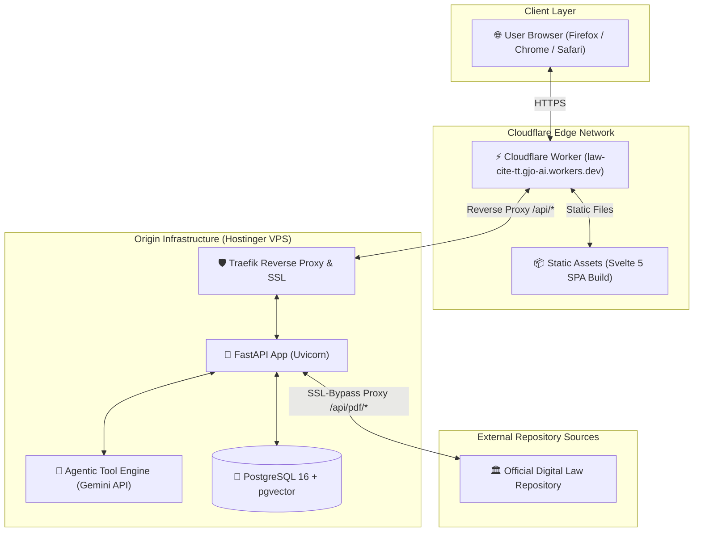

<div align="center">

# ⚖️ LawCite TT

### *Temporal Legal Engine & Citation Graph for the Laws of Trinidad and Tobago*

[](https://law-cite-tt.gjo-ai.workers.dev)
[-10b981?style=for-the-badge&logo=fastapi)](https://law-cite-tt.gjo-ai.workers.dev/api/health)
[](https://law-cite-tt.gjo-ai.workers.dev)
[](LICENSE)

---

[**Explore Live App**](https://law-cite-tt.gjo-ai.workers.dev) • [**API Health**](https://law-cite-tt.gjo-ai.workers.dev/api/health) • [**Features**](#-key-features) • [**Architecture**](#-architecture) • [**Local Setup**](#-getting-started)

</div>

<br/>

## 🌟 Overview

**LawCite TT** is an advanced legal research engine and temporal citation platform indexing the complete statutory laws and judicial precedent of **Trinidad and Tobago**. 

By digitizing and section-chunking all **533 statutory chapters** across **4,989 historical revisions** (spanning back to the 1800s), LawCite TT enables point-in-time statutory research (*"What did Section 5 of the Arbitration Act state as of December 31, 2016?"*), hybrid full-text + vector semantic search, and citation graph exploration across **7,914 case-law precedent edges**.

---

## ⚡ Key Features

<table>
  <tr>
    <td width="50%">
      <h3>🔍 Temporal Hybrid Search</h3>
      <p>Combine BM25 full-text matching with dense vector embeddings (384-dim BAAI/bge-small) to search statutory provisions as of any historical cutoff date.</p>
    </td>
    <td width="50%">
      <h3>🤖 Agentic Legal AI Chat</h3>
      <p>An autonomous legal research assistant equipped with tool-use capabilities to search statutory provisions, locate precedent cases, and synthesize citations.</p>
    </td>
  </tr>
  <tr>
    <td width="50%">
      <h3>📜 Precise Citation Resolver</h3>
      <p>Format, verify, and resolve statutory citations with exact section excerpts, historical revision tags, and copyable legal authority blocks.</p>
    </td>
    <td width="50%">
      <h3>🕸️ Precedent & Case Citation Graph</h3>
      <p>Explore statutory cross-references over 2,236 Judgments and High Court / Court of Appeal decisions mapped directly to cited legislative chapters.</p>
    </td>
  </tr>
  <tr>
    <td width="50%">
      <h3>🛡️ Zero-Trust PDF Proxy</h3>
      <p>Streams official statutory PDFs directly through a secure server-side proxy, bypassing government SSL certificate issues and DNS timeouts.</p>
    </td>
    <td width="50%">
      <h3>☁️ Edge-Native Architecture</h3>
      <p>Deployed as a high-performance Svelte 5 SPA on Cloudflare Workers edge, backed by a FastAPI + PostgreSQL/pgvector backend on a dedicated VPS.</p>
    </td>
  </tr>
</table>

---

## 📊 Corpus Statistics

| Metric | Count | Description |
| :--- | :---: | :--- |
| **Statutory Chapters** | `533` | Complete Laws of Trinidad and Tobago (Chap. 1:01 to 90:03) |
| **Historical Revisions** | `4,989` | Point-in-time revised editions from the 1800s to 2024 |
| **Embedded Chunks** | `407,008` | Section-aware statutory text chunks (384-dimensional vector index) |
| **Case Law Judgments** | `2,236` | Modern Supreme Court / High Court decisions |
| **Citation Edges** | `7,914` | Explicit statute-to-case citation links |

---

## 🏗️ Architecture



---

## 🛠️ Technology Stack

* **Frontend**: [Svelte 5](https://svelte.dev) (Runes API), Vite, Lucide Icons, Vanilla CSS Design Tokens
* **Edge Deployment**: [Cloudflare Workers](https://workers.cloudflare.com) (Static Assets + Worker Reverse Proxy)
* **Backend API**: [FastAPI](https://fastapi.tiangolo.com) (Python 3.13), Uvicorn, AsyncPG, HTTPX
* **Database & Vector Search**: [PostgreSQL 16](https://www.postgresql.org) + [pgvector](https://github.com/pgvector/pgvector), Hybrid FTS + HNSW Vector Indexing
* **Embeddings & AI**: `FastEmbed` (`BAAI/bge-small-en-v1.5`), Google Gemini API (`gemini-3.5-flash-lite`) via OpenAI-compatible endpoints
* **Infrastructure**: Traefik, Docker Compose, Hostinger VPS

---

## 🚀 Getting Started

### Prerequisites
- **Python 3.12+** & [`uv`](https://github.com/astral-sh/uv) package manager
- **Node.js 20+** & `npm`
- **Docker & Docker Compose** (for running local PostgreSQL + pgvector)

### 1. Backend Setup

```bash
# Clone the repository
git clone https://github.com/gregory1506/law-cite-tt.git
cd law-cite-tt

# Set up Python virtual environment
uv venv .venv
source .venv/bin/activate
uv pip install -r backend/requirements.txt

# Run pytest suite
pytest -v
```

### 2. Frontend Setup

```bash
cd citation-tool

# Install dependencies
npm install

# Run local development server (connects to local API)
npm run dev

# Run test suite
npm test
```

### 3. Production Deployment

```bash
# Build frontend with production API routing
cd citation-tool
npm run build

# Deploy frontend to Cloudflare Workers
npx wrangler deploy
```

---

## 📜 Ingestion & Crawl Policy

The statute corpus was constructed via a rate-limited ingestion pipeline (`backend/scraper/`). 

* **Rate Limiting**: Crawling executes with a mandatory $\ge 1.5\text{s}$ delay between requests out of respect for public digital law repository infrastructure.

* **Pagination**: The government portal returns an HTTP 500 status when paging past the last catalog entry. The ingestion engine in `backend/scraper/catalog.py` treats this as a graceful end-of-catalog signal.
* **Corpus Storage**: Raw extracted PDFs and markdown revisions reside on local SSD storage (`/Volumes/Extreme SSD/law-cite-tt-data/`), with indexed data migrated to PostgreSQL + pgvector for production search.

---

## 📄 License

This repository is licensed under the **MIT License**. Statutory laws of Trinidad and Tobago are public legal authorities.

<br/>

<div align="center">
  <sub>Built with ❤️ for the Legal Tech Community of Trinidad and Tobago.</sub>
</div>
